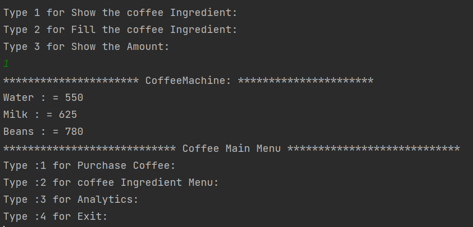

<h1 align="center"> 
Coffee Machine Simulator ☕</h1>

This is a Java console application that simulates a coffee machine. The program allows you to manage the coffee machine by performing various actions such as buying coffee, filling ingredients, taking money, and viewing the status and analytics of the machine.

---
## Prerequisites


## Features

The Coffee Machine Simulator provides the following features:

- **Buy**: Allows the user to purchase different types of coffee (Espresso, Latte, Cappuccino) with their respective prices. Coffee will be dispensed only if there are enough ingredients in the machine.

- **Espresso**: price - $4/cup, water needed – 250 ml/cup, milk needed – 0 ml/cup, beans needed - 16/cup

- **Latte**: price - $7/cup, water needed – 350 ml/cup, milk needed – 75 ml/cup, beans needed - 20/cup

- **Cappuccino**: price - $6/cup, water needed – 200 ml/cup milk needed – 100 ml/cup beans needed - 12/cup. 

- **Fill**: Enables the user to add more ingredients (water, milk, beans) to the coffee machine.
- **Show the coffee Ingredient**: Displays the current status of the coffee machine, including the amount of water, milk, beans, and money available.
- **Analytics**: Shows the total earnings, and the total amount of ingredients consumed.

## Getting Started

To run the Coffee Machine Simulator, follow these steps:

1. Ensure you have Java installed on your system.
2. Download the source code files or clone the repository.
3. Compile the Java source files using the following command:

```
javac CoffeeMachine.java
```

4. Run the application with the following command:

```
java CoffeeMachine
```

5. Follow the on-screen instructions to interact with the Coffee Machine Simulator.

## Usage

Once the application is running, you will be presented with a menu of actions to choose from. Enter the corresponding number for the action you want to perform:




Follow the prompts and enter the required information as requested by each action.

## OOPS Concepts Used

In the Coffee Machine Simulator code provided, several Object-Oriented Programming (OOP) concepts have been utilized. Here are the OOP concepts used in the implementation:

1. Classes and Objects:
   - The `CoffeeMachine` class represents the coffee machine and encapsulates its state and behavior.
   - The `Main` class contains the main method and serves as the entry point of the program.

2. Encapsulation:
   - The `CoffeeMachine` class encapsulates the internal state of the coffee machine, such as the amounts of water, milk, coffee beans, and money.
